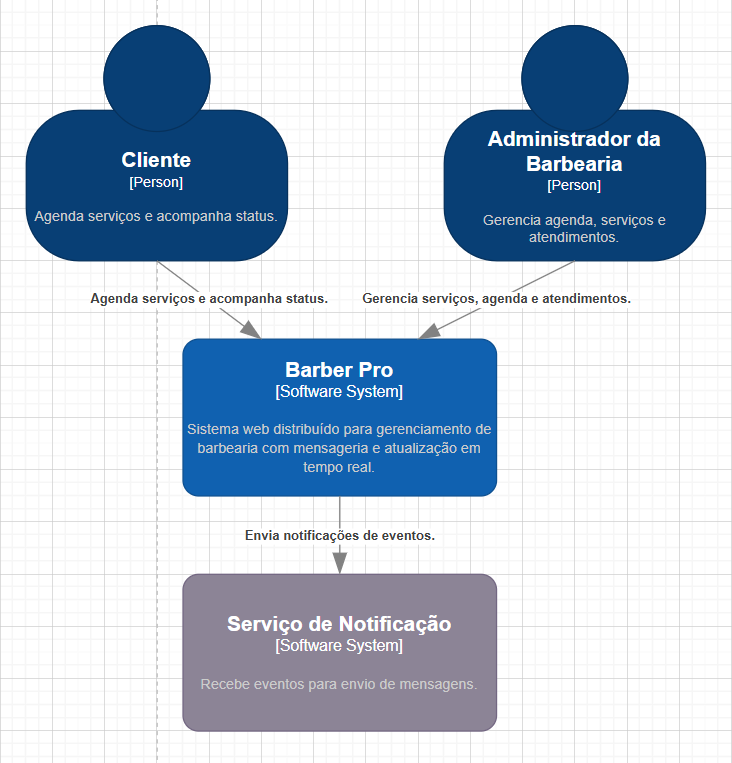
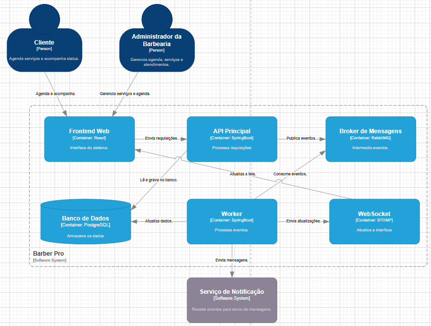

# BarberPro — Sistema de Gestão de Barbearia

O **BarberPro** é uma aplicação web full-stack desenvolvida para digitalizar e otimizar a gestão de serviços e agendamentos de uma barbearia.
O sistema atende dois perfis principais de usuário — **administrador/barbeiro** e **cliente** — oferecendo controle de agenda, cadastro de serviços e gerenciamento de atendimentos de forma digital, organizada e responsiva.

> Projeto acadêmico desenvolvido para a **Atividade Integrada — PUC Goiás** | Curso: **Análise e Desenvolvimento de Sistemas** 
>
> **Autores:** Gabriel da Silva Coelho · Frederico da Silva Kunert, Arthur Boaventura Riesco

---

## Índice

- [Identificação do Projeto](#identificação-do-projeto)
- [Problema que o Sistema Resolve](#problema-que-o-sistema-resolve)
- [Diagramas C4](#diagramas-c4)
- [Diagrama de Classes do Domínio](#diagrama-de-classes-do-domínio)
- [Arquitetura do Projeto](#arquitetura-do-projeto)
- [Design Patterns Aplicados](#design-patterns-aplicados)
- [Princípios SOLID](#princípios-solid)
- [Guia de Estilos](#guia-de-estilos)
- [Requisitos Não Funcionais](#requisitos-não-funcionais)
- [Perfis de Usuário e Permissões](#perfis-de-usuário-e-permissões)
- [Autenticação](#autenticação)
- [Banco de Dados](#banco-de-dados)
- [Principais Rotas da API](#principais-rotas-da-api)
- [Tecnologias Utilizadas](#tecnologias-utilizadas)
- [Como Executar o Projeto](#como-executar-o-projeto)
- [Artefatos Complementares](#artefatos-complementares)

---


## Problema que o Sistema Resolve

Em barbearias que ainda utilizam processos manuais ou comunicação informal para marcação de horários, é comum ocorrer:

- Conflitos de agendamento por falta de controle centralizado
- Dificuldade no controle e visualização da agenda
- Falta de padronização nos serviços cadastrados
- Dificuldade de acesso do cliente ao próprio histórico de atendimentos
- Pouca organização administrativa geral

O BarberPro foi criado para resolver esse cenário por meio de uma aplicação web simples, funcional e acessível.

---

## Diagramas C4

### Diagrama de Contexto (C4 — Nível 1)

O diagrama de contexto apresenta o sistema BarberPro em relação aos seus usuários e sistemas externos.

Dois atores interagem com o sistema:
- **Cliente** — agenda serviços e acompanha o status dos atendimentos
- **Administrador da Barbearia** — gerencia agenda, serviços e atendimentos

O sistema se integra com um **Serviço de Notificação** externo, que recebe eventos para envio de mensagens.

```

> 

---

### Diagrama de Container (C4 — Nível 2)

O diagrama de container detalha os componentes internos do sistema BarberPro:

| Container | Tecnologia | Responsabilidade |
|---|---|---|
| **Frontend Web** | React | Interface do sistema |
| **API Principal** | SpringBoot | Processa requisições |
| **Broker de Mensagens** | RabbitMQ | Intermedia eventos |
| **Banco de Dados** | PostgreSQL | Armazena os dados |
| **Worker** | SpringBoot | Processa eventos |
| **WebSocket** | STOMP | Atualiza a interface em tempo real |

**Fluxo interno:**
O Frontend envia requisições para a API Principal → A API publica eventos no Broker (RabbitMQ) → O Worker consome os eventos e atualiza o banco → O WebSocket envia atualizações em tempo real para o frontend → O sistema também envia notificações para o Serviço de Notificação externo.



---

## Diagrama de Classes do Domínio

O domínio é composto por três entidades principais:


### User

| Atributo | Tipo | Descrição |
|---|---|---|
| id | int (PK) | Identificador único |
| nome | string | Nome completo |
| email | string (UNIQUE) | E-mail de acesso |
| senha_hash | string | Senha criptografada com bcrypt |
| role | string | `'cliente'` \| `'barbeiro'` \| `'admin'` |
| created_at | Date | Data de cadastro |

Métodos: `findByEmail()` · `findById()` · `create()` · `findBarbeirosEAdmins()`

### Service

| Atributo | Tipo | Descrição |
|---|---|---|
| id | int (PK) | Identificador único |
| nome | string | Nome do serviço |
| descricao | string | Descrição opcional |
| preco | decimal(10,2) | Preço em reais |
| duracao_min | int | Duração em minutos |
| ativo | boolean | Se o serviço está disponível |
| created_at | Date | Data de criação |

Métodos: `findAll()` · `findById()` · `create()` · `update()` · `remove()`

### Appointment

| Atributo | Tipo | Descrição |
|---|---|---|
| id | int (PK) | Identificador único |
| cliente_id | int (FK) | Referência ao User (cliente) |
| barbeiro_id | int (FK) | Referência ao User (barbeiro) |
| service_id | int (FK) | Referência ao Service |
| data_hora | Date | Data e hora do agendamento |
| status | string | `'pendente'` \| `'confirmado'` \| `'concluido'` \| `'cancelado'` |
| observacoes | string | Observações opcionais |
| created_at | Date | Data de criação |

Métodos: `create()` · `findActive()` · `findHistory()` · `findActiveByClienteId()` · `findHistoryByClienteId()` · `findConflictByRange()` · `updateStatus()` · `remove()`

### Relacionamentos

```
User    "1" ──────── "*" Appointment  (via cliente_id)
User    "1" ──────── "*" Appointment  (via barbeiro_id)
Service "1" ──────── "*" Appointment  (via service_id)
```

---

## Arquitetura do Projeto

O sistema foi estruturado em **Arquitetura em Camadas (Layered Architecture)** com separação clara de responsabilidades entre cinco níveis:

```
[Frontend]  →  [Routes]  →  [Controllers]  →  [Services]  →  [Repositories]  →  [PostgreSQL]
```

| Camada | Responsabilidade | Arquivos Principais |
|---|---|---|
| **Frontend** | Interface do usuário — chamadas HTTP à API REST | `login.html`, `dashboard-admin.html`, `dashboard-cliente.html` |
| **Routes** | Define os endpoints e aplica middlewares | `auth.routes.js`, `services.routes.js`, `appointments.routes.js` |
| **Controllers** | Recebe req/res, chama o service e retorna a resposta HTTP | `auth.controller.js`, `service.controller.js`, `appointment.controller.js` |
| **Services** | Contém as regras de negócio e validações | `auth.service.js`, `service.service.js`, `appointment.service.js` |
| **Repositories** | Acesso ao banco via queries SQL parametrizadas | `user.repository.js`, `service.repository.js`, `appointment.repository.js` |

### Mapeamento de dependências

| Camada | Classe | Depende de |
|---|---|---|
| Repository | UserRepository | tabela `users` |
| Repository | ServiceRepository | tabela `services` |
| Repository | AppointmentRepository | tabela `appointments` |
| Service | AuthService | UserRepository |
| Service | ServiceService | ServiceRepository |
| Service | AppointmentService | AppointmentRepository + ServiceRepository |
| Controller | AuthController | AuthService |
| Controller | ServiceController | ServiceService |
| Controller | AppointmentController | AppointmentService |
| Middleware | authMiddleware | JWT (jsonwebtoken) |
| Middleware | roleMiddleware | `req.user.role` |
| Middleware | errorMiddleware | `statusCode` padronizado |

---

## Design Patterns Aplicados

### Pattern 1 — Middleware (Chain of Responsibility)

**Categoria:** Comportamental

**Problema:** Era necessário proteger rotas de login, serviços, agendamentos e administração sem repetir código de autenticação e autorização em todos os controllers.

**Solução:** Middlewares encadeados que interceptam a requisição antes de chegar ao controller:

- `authMiddleware` — verifica e decodifica o JWT, injeta `req.user` na requisição
- `roleMiddleware` — verifica se `req.user.role` possui permissão para acessar a rota
- `errorMiddleware` — captura erros lançados em qualquer camada e retorna resposta HTTP padronizada

**Benefícios:** Reutilização de código · Segurança centralizada · Fácil manutenção · Desacoplamento entre camadas

---

### Pattern 2 — Facade (Fachada)

**Categoria:** Estrutural

**Problema:** O frontend não pode acessar diretamente o banco de dados, os services ou as validações internas. Era necessária uma interface simples e unificada.

**Solução:** Os controllers funcionam como fachada única de acesso à lógica do sistema:

- `AuthController` — fachada para registro, login e consulta de perfil (`/me`)
- `ServiceController` — fachada para CRUD completo de serviços
- `AppointmentController` — fachada para agendamentos e mudança de status

**Benefícios:** Simplificação do acesso · Menor acoplamento · Ponto de entrada único por domínio · Código organizado

---

## Princípios SOLID

### S — Single Responsibility Principle (SRP)

Cada camada e arquivo possui uma única responsabilidade bem definida. Routes definem apenas endpoints, controllers tratam apenas req/res, services contêm apenas regras de negócio e repositories executam apenas queries ao banco.

| Módulo | Única Responsabilidade |
|---|---|
| Routes | Definir endpoints e aplicar middlewares |
| Controllers | Receber req/res e delegar ao service |
| Services | Regras de negócio e validações |
| Repositories | Acesso ao banco de dados |
| Middlewares | Autenticação, autorização e erros |

### D — Dependency Inversion Principle (DIP)

Camadas superiores dependem de abstrações (services), não de detalhes de implementação (banco de dados).

O `AppointmentController` depende de `AppointmentService`, que por sua vez depende de `AppointmentRepository`, isolando completamente o PostgreSQL das camadas superiores. Isso facilita a troca de banco de dados sem necessidade de alterar controllers ou services.

---

## Guia de Estilos

### Paleta de Cores

**Cores Primárias — Identidade da Marca**

| Nome | Hex | Uso |
|---|---|---|
| Navy | `#0B1730` | Fundo escuro principal, textos de título |
| Navy Light | `#162E63` | Fundo escuro suave, sidebar gradiente |
| Blue | `#355DAB` | Destaque, links, botão confirmar, focus |
| Blue Dark | `#27498E` | Hover do Blue |
| Gold | `#FFB300` | Ação principal (CTA), botão primário, nav ativa |
| Gold Dark | `#E19A00` | Hover do Gold |

**Cores Neutras**

| Nome | Hex | Uso |
|---|---|---|
| Background | `#DFE6F3` | Fundo das telas de dashboard |
| Background Soft | `#CFD9EC` | Gradiente suave do fundo |
| Card / Surface | `#F8FAFC` | Fundo de cards e painéis |
| Text Primary | `#14213D` | Texto principal do corpo |
| Text Muted | `#6B7280` | Texto secundário e subtítulos |
| Border | `#C8D2E4` | Bordas de inputs, cards e divisores |
| Danger | `#EF4444` | Erros, botão excluir/cancelar |
| Success | `#16A34A` | Sucesso, botão concluir, feedback positivo |

**Cores de Status — Badges de Agendamento**

| Status | Fundo | Texto |
|---|---|---|
| Pendente | `#FFE08A` | `#6B4F00` |
| Confirmado | `#DBEAFE` | `#1D4ED8` |
| Concluído | `#DCFCE7` | `#15803D` |
| Cancelado | `#FEE2E2` | `#B91C1C` |

### Tipografia

| Fonte | Família / Fallback | Uso | Tamanhos |
|---|---|---|---|
| **Oswald** | Oswald, Arial Black, sans-serif | Títulos, nome da marca (h1, h2) | 2.4rem / 2.2rem / 1.5rem |
| **Montserrat** | Montserrat, Segoe UI, Arial | Corpo, labels, botões | 0.95–0.98rem / labels: 0.9rem |

Pesos: `400` regular · `700` labels e navegação · `800` botões e badges

### Componentes Principais

| Componente | Descrição Visual |
|---|---|
| **Sidebar** | 280px, gradiente Navy, título Gold (Oswald), nav-btns com estado ativo em Gold |
| **Botão Primário** | Fundo `#FFB300`, texto Navy, peso 800, hover Gold Dark + `translateY(-1px)` |
| **Botão Perigo** | Fundo `#EF4444`, texto branco — logout, cancelar, excluir |
| **Input / Select** | Fundo `#F9FBFF`, borda `#C8D2E4`, focus: borda Blue + box-shadow azul |
| **Badge de Status** | Pill (`border-radius: 999px`), 0.78rem, peso 800, uppercase |
| **Card Item** | Fundo branco, borda `#C8D2E4`, `border-radius: 14px`, sombra suave |
| **Feedback (erro)** | Texto `#EF4444`, peso 600 |
| **Feedback (sucesso)** | Texto `#16A34A`, peso 600 |

### Responsividade

| Breakpoint | Comportamento |
|---|---|
| `>= 1024px` | Layout sidebar + conteúdo lado a lado (desktop) |
| `< 1024px` | Sidebar no topo, navegação em linha horizontal (tablet) |
| `< 768px` | Painéis com padding reduzido, grids em coluna única |
| `< 480px` | Fontes reduzidas, padding mínimo, botões em largura total |

---

## Requisitos Não Funcionais

| ID | Categoria | Requisito |
|---|---|---|
| RNF-01 | Desempenho | Requisições de listagem devem responder em no máximo 2 segundos para até 50 usuários simultâneos. Queries indexadas e parametrizadas. |
| RNF-02 | Segurança | Senhas com bcrypt (fator 10). JWT com expiração via `.env`. Rotas protegidas por `authMiddleware`. Credenciais nunca versionadas. |
| RNF-03 | Disponibilidade | Disponível durante horário de funcionamento (mínimo 12h/dia). Falhas retornam mensagem adequada sem expor detalhes internos. |
| RNF-04 | Manutenibilidade | Arquitetura em camadas com responsabilidades isoladas. Novos endpoints sem necessidade de alterar módulos existentes. |
| RNF-05 | Usabilidade | Feedback visual para todas as ações. Formulários com validação e mensagens claras. Navegação consistente entre telas. |
| RNF-06 | Compatibilidade | Funciona em Chrome, Firefox, Edge e Safari. Interface responsiva para desktop, tablet e mobile. |
| RNF-07 | Escalabilidade | Arquitetura preparada para integração de mensageria (RabbitMQ/Redis) sem refatoração estrutural. Banco via `pg.Pool`. |
| RNF-08 | Rastreabilidade | Registros com `created_at`. Erros capturados pelo middleware centralizado com `statusCode` padronizado. |
| RNF-09 | Confiabilidade | Sistema detecta e rejeita agendamentos conflitantes para o mesmo barbeiro. Exclusões verificam existência antes de executar (404). |
| RNF-10 | Containerização | Ambiente executável via Docker para consistência entre desenvolvimento e produção. |

---

## Perfis de Usuário e Permissões

| Funcionalidade | Cliente | Barbeiro | Admin |
|---|:---:|:---:|:---:|
| Login / Cadastro | ✅ | ✅ | ✅ |
| Ver próprios agendamentos | ✅ | ✅ | ✅ |
| Criar agendamento | ✅ | ❌ | ❌ |
| Ver todos os agendamentos | ❌ | ✅ | ✅ |
| Atualizar status de agendamento | ❌ | ✅ | ✅ |
| Cadastrar / editar serviços | ❌ | ✅ | ✅ |
| Excluir serviços | ❌ | ✅ | ✅ |

---

## Autenticação

A autenticação é realizada por meio de **JWT (JSON Web Token)**.

### Fluxo de autenticação

1. o usuário realiza login com e-mail e senha
2. a API valida as credenciais e gera um token JWT contendo `id`, `nome`, `email` e `role`
3. o token é armazenado no `localStorage` do navegador
4. as requisições protegidas enviam o token no header `Authorization: Bearer <token>`
5. o `authMiddleware` valida o token e injeta `req.user` na requisição
6. o `roleMiddleware` verifica se o perfil do usuário tem permissão para acessar a rota

---

## Banco de Dados

Banco utilizado: **PostgreSQL**

### Entidades principais

```sql
users        → id, nome, email, senha_hash, role, created_at
services     → id, nome, descricao, preco, duracao_min, ativo, created_at
appointments → id, cliente_id, barbeiro_id, service_id, data_hora, status, observacoes, created_at
```

### Relacionamentos

- `User` (cliente) `1 ──── *` `Appointment` via `cliente_id`
- `User` (barbeiro) `1 ──── *` `Appointment` via `barbeiro_id`
- `Service` `1 ──── *` `Appointment` via `service_id`

---

## Principais Rotas da API

Base URL: `http://localhost:3000`

Rotas protegidas exigem o header: `Authorization: Bearer <token>`

### Autenticação — `/api/auth`

| Método | Rota | Proteção | Descrição |
|---|---|---|---|
| `POST` | `/api/auth/register` | Pública | Cadastro de novo cliente |
| `POST` | `/api/auth/login` | Pública | Login e geração de JWT |
| `GET` | `/api/auth/me` | `authMiddleware` | Retorna dados do usuário logado |

### Serviços — `/api/services`

| Método | Rota | Proteção | Descrição |
|---|---|---|---|
| `GET` | `/api/services` | `authMiddleware` | Lista todos os serviços ativos |
| `POST` | `/api/services` | `admin \| barbeiro` | Cria novo serviço |
| `PUT` | `/api/services/:id` | `admin \| barbeiro` | Edita serviço existente |
| `DELETE` | `/api/services/:id` | `admin \| barbeiro` | Remove serviço |

### Agendamentos — `/api/appointments`

| Método | Rota | Proteção | Descrição |
|---|---|---|---|
| `GET` | `/api/appointments` | `authMiddleware` | Lista agendamentos (filtrado por role) |
| `POST` | `/api/appointments` | `cliente` | Cria novo agendamento |
| `PATCH` | `/api/appointments/:id/status` | `admin \| barbeiro` | Atualiza status do agendamento |
| `DELETE` | `/api/appointments/:id` | `authMiddleware` | Remove agendamento (dono ou admin) |
| `GET` | `/api/barbeiros` | `authMiddleware` | Lista barbeiros e admins disponíveis |

---

## Tecnologias Utilizadas

### Back-end

| Tecnologia | Versão | Uso |
|---|---|---|
| Node.js | v18+ | Runtime |
| Express.js | v4.19 | Framework HTTP |
| PostgreSQL | — | Banco de dados relacional |
| pg (node-postgres) | v8.12 | Driver do banco |
| jsonwebtoken | v9.0 | Geração e validação de JWT |
| bcrypt | v5.1 | Hash de senhas |
| dotenv | v16.4 | Variáveis de ambiente |

### Front-end

- HTML5 semântico
- CSS3 responsivo com variáveis CSS (`--navy`, `--gold`, etc.)
- JavaScript Vanilla + Fetch API
- Bootstrap 5 como base do Design System

### Infraestrutura

- Docker (containerização do ambiente)
- Git / GitHub (controle de versão)

---

## Como Executar o Projeto

### Pré-requisitos

- Node.js v18+ instalado
- PostgreSQL instalado e em execução
- Git instalado
- Docker (opcional)

### Passo a passo

#### 1) Clone o repositório

```bash
git clone https://github.com/GabrielDaSilvaCoelho/BarbeariaTerminal.git
cd BarbeariaTerminal-main
```

#### 2) Instale as dependências

```bash
npm install
```

#### 3) Configure as variáveis de ambiente

Crie um arquivo `.env` na raiz do projeto:

```env
PORT=3000
DB_HOST=localhost
DB_PORT=5432
DB_NAME=barberpro
DB_USER=postgres
DB_PASSWORD=sua_senha
JWT_SECRET=sua_chave_jwt
JWT_EXPIRES_IN=7d
```

#### 4) Crie o banco de dados

```sql
CREATE DATABASE barberpro;
```

#### 5) Execute o script SQL

```bash
psql -U postgres -d barberpro -f database.sql
```

#### 6) Popule dados iniciais

```bash
npm run seed
```

#### 7) Inicie o servidor

```bash
npm start
```

O servidor estará disponível em `http://localhost:3000`

### Telas principais

| Arquivo | Descrição |
|---|---|
| `frontend/login.html` | Tela de login |
| `frontend/cadastro.html` | Tela de cadastro de cliente |
| `frontend/dashboard-admin.html` | Painel do administrador/barbeiro |
| `frontend/dashboard-cliente.html` | Painel do cliente |
| `frontend/novo-agendamento.html` | Formulário de novo agendamento |
| `frontend/novo-servico.html` | Formulário de cadastro de serviço |

### Usuários para demonstração

| Perfil | E-mail | Senha |
|---|---|---|
| Administrador | `admin@barberpro.com` | `123456` |
| Cliente | `cliente@barberpro.com` | `123456` |

---

## Artefatos Complementares

Na pasta `docs/` estão disponíveis:

- `contexto.png` — Diagrama C4 de Contexto
- `container.png` — Diagrama C4 de Container
- `Captura_de_tela_2026-04-13_230656.png` — Diagrama de Classes do domínio
- `Documentação dos 2 Design Patterns.txt` — Documentação detalhada dos padrões
- `2 princípios SOLID explicados.txt` — Aplicação dos princípios SOLID
- `Checklist de Boas Práticas UIUX.txt` — Checklist de UI/UX atendidos
- `Justificativa do Design System.txt` — Justificativa da escolha do Bootstrap 5
- `link do figma.txt` — Link do protótipo navegável

### Protótipo Figma

```
https://www.figma.com/design/dF1zbDsM0UU1dAzf8m0vzO/figma-integrador?t=M42LjVbKz4aMdz3u-0
```

---
# Autores
**GABRIEL DA SILVA COELHO**
**FREDERICO DA SILVA KUNERT**
**ARTHUR BOAVENTURA RIESCO**
Projeto acadêmico desenvolvido para a **Atividade Integrada — PUC Goiás**
Curso: **Análise e Desenvolvimento de Sistemas**
