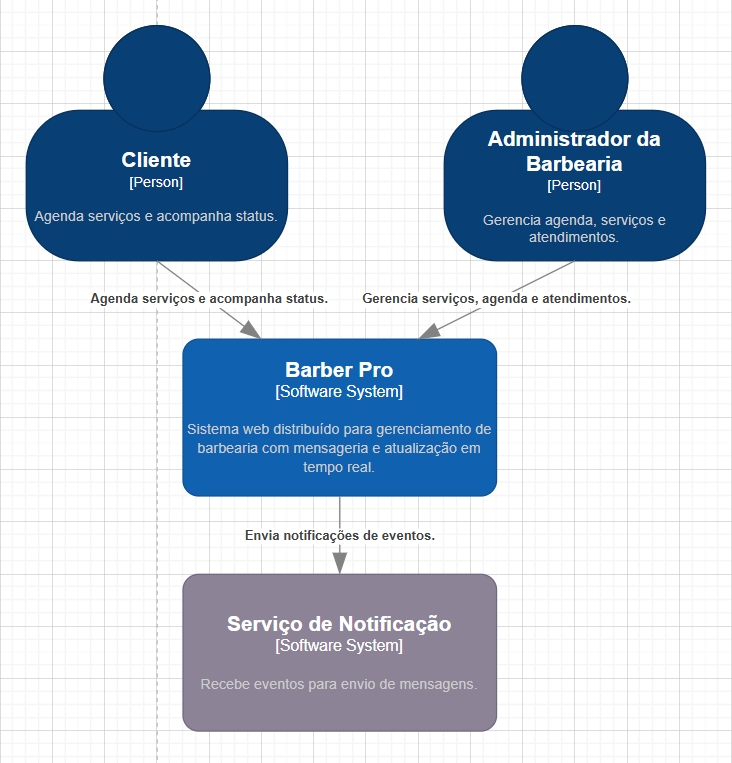
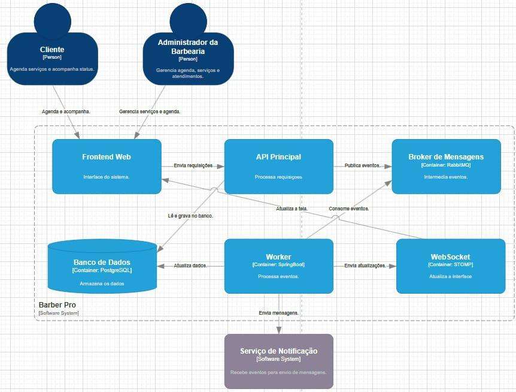
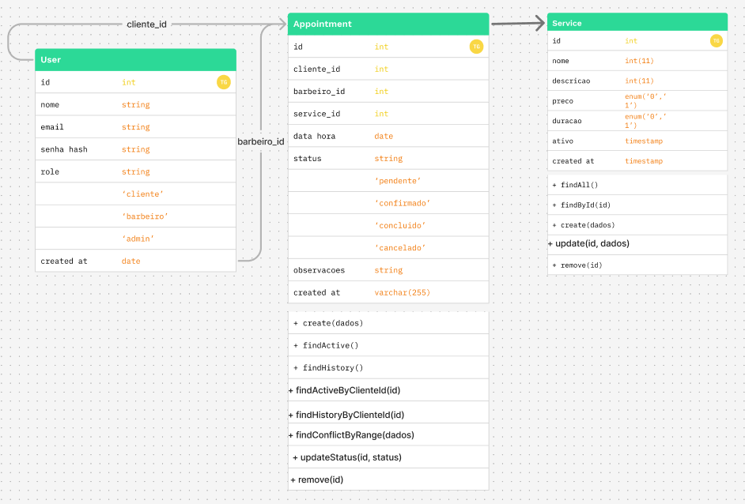

# BarberPro — Sistema Web de Gestão de Barbearia

O **BarberPro** é uma aplicação web full-stack para gestão de uma barbearia, com cadastro de usuários, autenticação, controle de serviços, criação de agendamentos, confirmação de atendimentos, notificações em tempo real e mensageria assíncrona com RabbitMQ.

A versão atual do projeto utiliza **Spring Boot no backend**, **React com Vite no frontend**, **PostgreSQL como banco de dados**, **RabbitMQ para mensageria**, **WebSocket/STOMP para atualização em tempo real** e **JWT para autenticação**.

> Projeto acadêmico desenvolvido para prática de arquitetura web, backend Java, frontend React, banco de dados, mensageria e testes automatizados.

---

## Sumário

- [Visão geral](#visão-geral)
- [Principais funcionalidades](#principais-funcionalidades)
- [Tecnologias utilizadas](#tecnologias-utilizadas)
- [Arquitetura do projeto](#arquitetura-do-projeto)
- [Fluxo principal do sistema](#fluxo-principal-do-sistema)
- [Mensageria com RabbitMQ](#mensageria-com-rabbitmq)
- [WebSocket e notificações em tempo real](#websocket-e-notificações-em-tempo-real)
- [Estrutura de pastas](#estrutura-de-pastas)
- [Pré-requisitos](#pré-requisitos)
- [Como rodar o projeto](#como-rodar-o-projeto)
- [Usuários de teste](#usuários-de-teste)
- [Variáveis de ambiente](#variáveis-de-ambiente)
- [Endpoints principais](#endpoints-principais)
- [Banco de dados](#banco-de-dados)
- [Testes automatizados](#testes-automatizados)
- [GitHub Actions](#github-actions)
- [Documentação e diagramas](#documentação-e-diagramas)
- [Observações importantes](#observações-importantes)
- [Melhorias futuras](#melhorias-futuras)
- [Autores](#autores)

---

## Visão geral

O sistema foi pensado para substituir o controle manual de horários em uma barbearia. Com ele, clientes podem se cadastrar, fazer login, consultar serviços disponíveis e solicitar agendamentos. Administradores e barbeiros podem visualizar atendimentos, cadastrar serviços e alterar o status dos agendamentos.

A aplicação também possui um fluxo assíncrono com RabbitMQ: quando um cliente cria um agendamento, o backend salva os dados no PostgreSQL, publica uma mensagem em uma exchange do RabbitMQ e o consumidor processa essa mensagem para notificar o painel do administrador ou barbeiro em tempo real.

---

## Principais funcionalidades

### Cliente

- Cadastro de conta.
- Login com e-mail e senha.
- Criação de agendamentos.
- Consulta de agendamentos ativos.
- Consulta de histórico.
- Cancelamento de agendamento próprio.
- Visualização de horários disponíveis.

### Administrador e barbeiro

- Login com perfil administrativo ou barbeiro.
- Visualização dos agendamentos.
- Cadastro de novos serviços.
- Edição de serviços existentes.
- Inativação de serviços.
- Confirmação, cancelamento ou conclusão de atendimentos.
- Recebimento de notificações em tempo real via WebSocket.

### Sistema

- Autenticação com JWT.
- Proteção de rotas por perfil de usuário.
- Validação de conflito de horários.
- Mensageria assíncrona com RabbitMQ.
- Notificações em tempo real com WebSocket/STOMP.
- Persistência de dados com PostgreSQL.
- Testes automatizados com JUnit, Mockito e JaCoCo.

---

## Tecnologias utilizadas

### Backend

- Java 21
- Spring Boot 4.0.6
- Spring Web MVC
- Spring Data JPA
- Spring Security
- JWT com `jjwt`
- Spring AMQP
- RabbitMQ
- WebSocket/STOMP
- PostgreSQL Driver
- Bean Validation
- Lombok
- Maven Wrapper
- JaCoCo
- JUnit 5
- Mockito
- AssertJ

### Frontend

- React 19
- Vite
- JavaScript
- Axios
- React Router DOM
- STOMP JS
- SockJS Client
- CSS

### Infraestrutura local

- PostgreSQL
- RabbitMQ Management
- Docker / Docker Compose

---

## Arquitetura do projeto

O projeto segue uma organização em camadas no backend e separa claramente frontend e backend.

```text
React + Vite
     ↓
API REST Spring Boot
     ↓
Regras de negócio / Services
     ↓
Repositories / JPA
     ↓
PostgreSQL
```

Além do fluxo REST tradicional, o sistema usa mensageria e WebSocket:

```text
Cliente cria agendamento
     ↓
Backend salva no PostgreSQL
     ↓
Backend publica evento no RabbitMQ
     ↓
AppointmentConsumer consome a mensagem
     ↓
WebSocketNotificationService envia atualização
     ↓
Painel do admin/barbeiro recebe em tempo real
```

---

## Fluxo principal do sistema

1. O usuário acessa o frontend em React.
2. O usuário faz login ou cria uma conta.
3. O backend autentica o usuário e retorna um token JWT.
4. O frontend armazena o token e o envia nas próximas requisições.
5. O cliente escolhe serviço, barbeiro e horário.
6. O backend valida se não há conflito de horário.
7. O agendamento é salvo com status `PENDENTE`.
8. O backend publica uma mensagem no RabbitMQ.
9. O consumer recebe a mensagem e notifica admin/barbeiro via WebSocket.
10. O barbeiro ou administrador pode confirmar, cancelar ou concluir o atendimento.

---

## Mensageria com RabbitMQ

A mensageria é usada para desacoplar a criação do agendamento da notificação para o painel administrativo.

### Exchange

```text
barberpro.exchange
```

Tipo:

```text
TopicExchange
```

### Fila principal de agendamentos

```text
barberpro.appointments.queue
```

Essa fila recebe eventos de criação de agendamento.

### Routing key de criação de agendamento

A routing key é dinâmica por barbeiro:

```text
appointment.barbeiro.{idDoBarbeiro}
```

Exemplo:

```text
appointment.barbeiro.2
```

O binding da fila principal aceita o padrão:

```text
appointment.barbeiro.*
```

### Fila de conclusão de agendamento

```text
barberpro.appointments.done.queue
```

### Routing key de conclusão

```text
appointment.concluido
```

### Fila de teste

```text
barberpro.hello.queue
```

### Routing key de teste

```text
hello.message
```

### Fluxo real da mensageria

```text
POST /api/appointments
     ↓
AppointmentService.create()
     ↓
Salva o agendamento como PENDENTE
     ↓
AppointmentProducer.publishAppointmentCreated()
     ↓
RabbitMQ recebe mensagem em barberpro.exchange
     ↓
Mensagem entra na fila barberpro.appointments.queue
     ↓
AppointmentConsumer.consume()
     ↓
Consumer busca o agendamento no banco
     ↓
Consumer notifica admin/barbeiro via WebSocket
```

O consumer **não confirma automaticamente** o agendamento criado. Ele notifica o barbeiro/admin e o agendamento fica aguardando confirmação manual.

Status usados atualmente:

```text
PENDENTE
PROCESSANDO
CONFIRMADO
CONCLUIDO
CANCELADO
ERRO
```

---

## WebSocket e notificações em tempo real

O backend expõe o endpoint WebSocket:

```text
/ws
```

O broker usa os prefixos:

```text
/topic
/queue
```

Tópico para administradores:

```text
/topic/appointments/admin
```

Tópico para barbeiros:

```text
/topic/appointments/{idDoBarbeiro}
```

Quando um agendamento é criado, alterado, cancelado ou concluído, o backend envia uma atualização para o painel correspondente.

---

## Estrutura de pastas

```text
BarbeariaTerminal-migracao/
├── Backend/
│   └── barberproapi/
│       ├── src/
│       │   ├── main/
│       │   │   ├── java/com/barberpro/barberproapi/
│       │   │   └── resources/
│       │   └── test/
│       ├── pom.xml
│       ├── mvnw
│       └── mvnw.cmd
│
├── Frontend/
│   └── barberpro-web/
│       ├── src/
│       ├── package.json
│       └── vite.config.js
│
├── docs/
├── docker-compose.yml
├── .gitignore
└── README.md
```

### Backend

Pacote principal:

```text
com.barberpro.barberproapi
```

Organização:

```text
config/       Configurações de segurança, JWT, RabbitMQ e WebSocket
controller/   Endpoints REST
domain/       Entidades JPA, enums e objetos de domínio
dto/          Objetos de entrada e saída da API
repository/   Interfaces Spring Data JPA
service/      Regras de negócio, producer e notificações
consumer/     Consumers do RabbitMQ
exception/    Tratamento global de exceções
```

### Frontend

```text
components/   Componentes reutilizáveis
contexts/     Contexto de autenticação
pages/        Telas da aplicação
routes/       Rotas protegidas e públicas
services/     Comunicação com a API
styles/       Estilos globais
```

---

## Pré-requisitos

Antes de rodar o projeto, instale:

- Java 21
- Node.js
- Docker Desktop
- Git
- PostgreSQL, caso não use o PostgreSQL pelo Docker Compose
- VS Code, IntelliJ, STS ou outra IDE de preferência

---

## Como rodar o projeto

### 1. Clonar o repositório

```bash
git clone <URL_DO_REPOSITORIO>
cd BarbeariaTerminal-migracao
```

### 2. Subir PostgreSQL e RabbitMQ com Docker Compose

Na raiz do projeto, execute:

```bash
docker compose up -d
```

Esse comando sobe:

```text
PostgreSQL: localhost:5432
RabbitMQ:   localhost:5672
Painel UI:  http://localhost:15672
```

Login do RabbitMQ:

```text
Usuário: guest
Senha: guest
```

Para verificar se os containers estão rodando:

```bash
docker ps
```

Para parar os containers:

```bash
docker compose down
```

### 3. Rodar o backend

No Windows PowerShell:

```powershell
cd Backend/barberproapi
.\mvnw.cmd spring-boot:run
```

No Git Bash ou Linux:

```bash
cd Backend/barberproapi
./mvnw spring-boot:run
```

O backend roda em:

```text
http://localhost:8080
```

### 4. Rodar o frontend

Em outro terminal:

```bash
cd Frontend/barberpro-web
npm install
npm run dev
```

O frontend roda em:

```text
http://localhost:5173
```

---

## Usuários de teste

O backend possui um `DataSeeder` que cria usuários e serviços iniciais automaticamente.

### Administrador

```text
E-mail: admin@barberpro.com
Senha: 123456
```

### Barbeiro

```text
E-mail: carlos@barberpro.com
Senha: 123456
```

### Cliente

```text
E-mail: joao@barberpro.com
Senha: 123456
```

---

## Variáveis de ambiente

O arquivo `application.properties` usa valores padrão, mas também aceita variáveis de ambiente.

| Variável | Valor padrão | Descrição |
|---|---|---|
| `DB_URL` | `jdbc:postgresql://localhost:5432/barberpro_spring` | URL do banco PostgreSQL |
| `DB_USER` | `postgres` | Usuário do banco |
| `DB_PASSWORD` | `1234` | Senha do banco |
| `RABBITMQ_HOST` | `localhost` | Host do RabbitMQ |
| `RABBITMQ_PORT` | `5672` | Porta AMQP do RabbitMQ |
| `RABBITMQ_USER` | `guest` | Usuário do RabbitMQ |
| `RABBITMQ_PASS` | `guest` | Senha do RabbitMQ |
| `JWT_SECRET` | `barberpro-super-secret-key-2026-projeto-integrador` | Chave para assinatura do JWT |
| `JWT_EXPIRATION_MS` | `86400000` | Tempo de expiração do token em milissegundos |
| `CORS_ORIGINS` | `http://localhost:5173,http://localhost:3000,http://localhost:8080` | Origens liberadas no CORS |

No frontend, a base da API pode ser configurada com:

```text
VITE_API_URL=http://localhost:8080/api
```

Caso essa variável não exista, o frontend usa automaticamente:

```text
http://localhost:8080/api
```

---

## Endpoints principais

### Autenticação

| Método | Endpoint | Descrição | Acesso |
|---|---|---|---|
| `POST` | `/api/auth/register` | Cadastra usuário | Público |
| `POST` | `/api/auth/login` | Realiza login | Público |
| `GET` | `/api/auth/me` | Retorna usuário autenticado | Autenticado |

### Serviços

| Método | Endpoint | Descrição | Acesso |
|---|---|---|---|
| `GET` | `/api/services` | Lista serviços | Autenticado |
| `POST` | `/api/services` | Cria serviço | ADMIN/BARBEIRO |
| `PUT` | `/api/services/{id}` | Atualiza serviço | ADMIN/BARBEIRO |
| `DELETE` | `/api/services/{id}` | Remove ou inativa serviço | ADMIN/BARBEIRO |

### Agendamentos

| Método | Endpoint | Descrição | Acesso |
|---|---|---|---|
| `GET` | `/api/appointments?tipo=ativos` | Lista agendamentos ativos | Autenticado |
| `GET` | `/api/appointments?tipo=historico` | Lista histórico | Autenticado |
| `POST` | `/api/appointments` | Cria agendamento | CLIENTE |
| `PATCH` | `/api/appointments/{id}/status` | Atualiza status | ADMIN/BARBEIRO |
| `DELETE` | `/api/appointments/{id}` | Cancela agendamento | Autenticado |
| `GET` | `/api/appointments/disponibilidade` | Lista horários disponíveis | Autenticado |

Exemplo de consulta de disponibilidade:

```text
GET /api/appointments/disponibilidade?barbeiroId=2&serviceId=1&data=2026-06-04
```

### Barbeiros

| Método | Endpoint | Descrição | Acesso |
|---|---|---|---|
| `GET` | `/api/barbeiros` | Lista barbeiros/admins disponíveis | Autenticado |

### Teste de mensageria

| Método | Endpoint | Descrição | Acesso |
|---|---|---|---|
| `POST` | `/api/hello` | Publica mensagem de teste no RabbitMQ | Autenticado |

Exemplo de body:

```json
{
  "message": "Teste de fila RabbitMQ"
}
```

---

## Banco de dados

Banco usado:

```text
barberpro_spring
```

Principais tabelas:

```text
users
services
appointments
appointment_events
```

As tabelas são geradas/atualizadas automaticamente pelo Hibernate com:

```properties
spring.jpa.hibernate.ddl-auto=update
```

---

## Testes automatizados

O backend possui testes automatizados com JUnit 5, Mockito, AssertJ e Spring Boot Test.

Para rodar os testes, primeiro mantenha PostgreSQL e RabbitMQ ativos:

```bash
docker compose up -d
```

Depois execute:

No Windows PowerShell:

```powershell
cd Backend/barberproapi
.\mvnw.cmd test
```

No Git Bash ou Linux:

```bash
cd Backend/barberproapi
./mvnw test
```

### Testes existentes

```text
BarberproapiApplicationTests.java              1 teste
AppointmentConsumerTest.java                   3 testes
AppointmentServiceTest.java                   11 testes
StandardConfirmationStrategyTest.java          9 testes
```

Total atual:

```text
24 testes
0 falhas
0 erros
0 ignorados
```

### Cobertura com JaCoCo

O projeto gera relatório de cobertura em:

```text
Backend/barberproapi/target/site/jacoco/index.html
```

### Observação sobre os testes

Os testes unitários de service, consumer e strategy usam Mockito. O teste de contexto do Spring Boot sobe a aplicação e, na configuração atual, depende de PostgreSQL e RabbitMQ disponíveis em `localhost`.

---

## GitHub Actions

O projeto pode ser validado automaticamente no GitHub Actions usando um workflow de CI para o backend.

Caminho sugerido do arquivo:

```text
.github/workflows/backend-ci.yml
```

O workflow deve:

1. Baixar o código.
2. Configurar Java 21.
3. Subir PostgreSQL como service container.
4. Subir RabbitMQ como service container.
5. Rodar `./mvnw test` dentro de `Backend/barberproapi`.
6. Salvar relatórios do Surefire e JaCoCo como artefatos.

Depois de criar o workflow, o GitHub executará os testes automaticamente a cada `push` ou `pull_request` nas branches configuradas.

---

## Documentação e diagramas

A pasta `docs/` contém materiais complementares do projeto, como documentação acadêmica, diagramas e arquivos relacionados ao design do sistema.

Arquivos relevantes:

```text
docs/contexto.png
docs/conteiner.jpeg
docs/Diagramaclasse.png
docs/ArtefatosBarberPRO.pdf
docs/BarberPro.docx
docs/Design_System.docx
```

### Diagrama de contexto

```md

```

### Diagrama de container

```md

```

### Diagrama de classes

```md

```

---

## Observações importantes

- O backend roda na porta `8080`.
- O frontend roda na porta `5173`.
- O PostgreSQL usa a porta `5432`.
- O RabbitMQ usa a porta `5672`.
- O painel web do RabbitMQ usa a porta `15672`.
- Acessar `http://localhost:8080` diretamente pode retornar `403`, pois a API é protegida pelo Spring Security.
- Se o RabbitMQ mostrar `Ready: 0`, `Unacked: 0` e `Total: 0`, isso não significa erro necessariamente. A mensagem pode ter sido consumida rapidamente pelo consumer.
- A fila `barberpro.hello.queue` é usada apenas para teste simples de mensageria.
- As filas principais de agendamento são duráveis.
- O status `AGUARDANDO_CONFIRMACAO` não faz parte do enum atual do projeto.

---

## Autores

- Gabriel da Silva Coelho
- Frederico da Silva Kunert
- Arthur Boaventura Riesco

---

## Status atual

```text
Backend: Spring Boot 4.0.6
Frontend: React + Vite
Banco de dados: PostgreSQL
Mensageria: RabbitMQ
Tempo real: WebSocket/STOMP
Autenticação: JWT
Testes backend: 24 testes passando
Status: funcional em ambiente local
```
